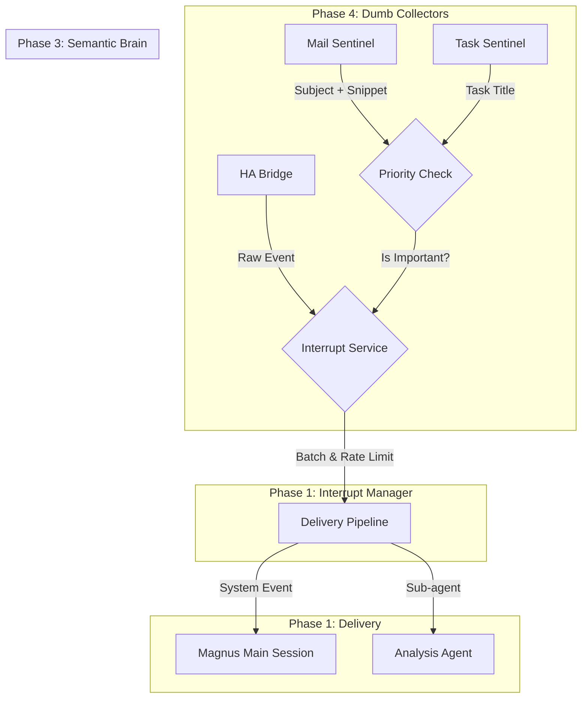

# Unified Interrupt & Semantic Priority Architecture

## 1. Vision

We are moving away from ad-hoc, hardcoded interrupt logic (currently embedded in `home-presence`) towards a **modular, reusable architecture**. 

The goal is to enable "Passive Monitoring" across **any** data stream (Home Assistant, Email, Google Tasks, RSS) with a unified way to:
1.  **Detect** events efficiently (dumb scripts).
2.  **Evaluate** their importance (semantic/keyword filtering).
3.  **Interrupt** the agent/user (rate-limited, routed delivery).

This decoupling ensures we do not duplicate rate-limiting, batching, or notification logic in every single skill.

## 2. Architecture Overview

## 3. Implementation Phases

### Phase 1: The Unified Interrupt Service
**Reference:** [Detailed PRD](skills/interrupt-service/PRD.md)

**Goal:** Extract the "Pipeline" logic from `home-presence` into a generic standalone daemon.
- **Component:** `interrupt-service` (Systemd Daemon).
- **Responsibilities:**
    - **API:** `trigger(source, data)` (via CLI or HTTP).
    - **Governance:** Centralized Rate Limiting (Circuit Breakers) & Batching.
    - **Delivery:** Injecting `openclaw system event` or spawning sub-agents.
    - **Routing:** Mapping `source` -> `rules` -> `action`.
- **Key Change:** Decoupling from Home Assistant entity structures.

### Phase 2: Refactor Home Presence (`skills/home-presence`)
**Goal:** Make `ha-bridge` a "dumb client" of the new service.
- **Action:** Remove internal `interrupt-manager.js` from `ha-bridge.js`.
- **New Logic:** `ha-bridge` simply forwards relevant state changes to `interrupt-service` via CLI/IPC.
- **Result:** `ha-bridge` becomes lighter; interrupt logic is centralized.

### Phase 3: The Semantic Filter
**Reference:** [Detailed PRD](skills/priority-check/PRD.md)

**Goal:** A reusable brain for determining "Is this text important?"
- **Component:** `priority-check` (CLI Tool).
- **Features:** "Filter Pyramid" strategy.
    1.  **Keyword (Fast):** "Nvidia", "Urgent".
    2.  **Semantic (Smart):** Local Embeddings (concept match for "Health", "Social").
    3.  **Hybrid:** Best of both.
- **Output:** Score & Topic match.

### Phase 4: The New Collectors (`skills/mail-sentinel`, `task-sentinel`)
**Goal:** Expand monitoring to new domains using the components above.
- **Mail Sentinel:**
    - Runs via `task-orchestrator` (e.g., every 5 min).
    - Fetches unread headers.
    - Calls `priority-check`.
    - If priority -> Calls `interrupt-service`.
- **Task Sentinel:**
    - Direct Google Tasks API poll (bypassing slow HA).
    - Checks for diffs.
    - Calls `interrupt-service`.

## 4. Guiding Principles
1.  **Reuse > Duplicate:** Don't write rate-limiting logic twice.
2.  **Dumb Collectors:** Collectors should do minimum work (fetch & forward). Complexity lives in the Service/Check skills.
3.  **Passive by Default:** The system runs silently in the background (systemd). The Agent (Magnus) is only woken when strictly necessary.
