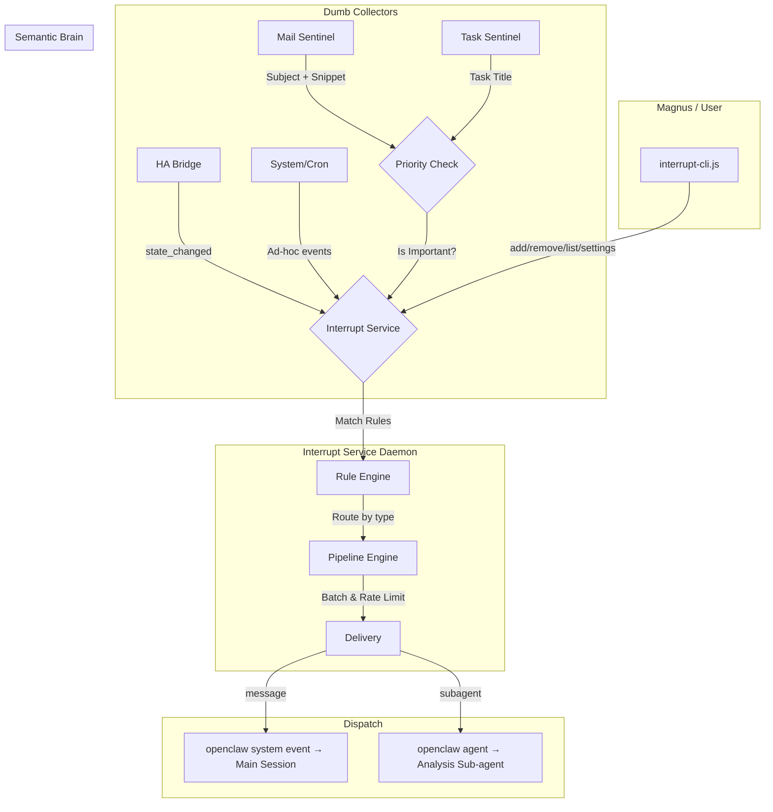

# Unified Interrupt & Semantic Priority Architecture

## 1. Vision

A **single centralized daemon** that handles ALL asynchronous interrupts for OpenClaw — from any data stream (Home Assistant, Email, Google Tasks, RSS, system events). The agent (Magnus) interacts with ONE tool to register, manage, and receive interrupts regardless of source.

**Core Goals:**
1. **Detect** events efficiently (dumb collector scripts).
2. **Evaluate** their importance (semantic/keyword filtering, or per-rule instructions).
3. **Interrupt** the agent/user (rate-limited, batched, routed delivery).

This replaces the ad-hoc interrupt logic previously embedded in `home-presence` with a generic, reusable architecture. No skill should ever duplicate rate-limiting, batching, or notification logic.

## 2. Architecture Decision: Single Daemon (Not Library)

**Why a centralized daemon instead of a shared library?**

| Criterion | Library (each skill runs own pipeline) | Single Daemon |
|-----------|----------------------------------------|---------------|
| Source of truth | N separate rule stores | **One rule store** |
| State drift | Each skill has independent rate limits/timers | **No drift — one process** |
| Magnus UX | N different CLIs to register interrupts | **One CLI, one API** |
| Global rate limiting | Impossible — each skill limits independently | **Cross-source flood protection** |
| Duplication | Pipeline logic copied/imported everywhere | **Zero duplication** |
| Future skills | Must integrate library + run daemon | **Just POST /trigger** |

**Decision:** Single systemd daemon (`interrupt-service`) on a local HTTP port. Collectors are dumb scripts that POST events. Magnus registers/manages rules via a single CLI.

## 3. Architecture Overview



## 4. Implementation Phases

### Phase 1: The Unified Interrupt Service
**Reference:** [Detailed PRD](skills/interrupt-service/PRD.md)

**Goal:** A single generic daemon that replaces the `interrupt-manager.js` previously embedded in `home-presence`, while being source-agnostic and extensible.

- **Component:** `interrupt-service` (systemd daemon, Node.js, port 7600).
- **Responsibilities:**
    - **Rule Management:** CRUD for persistent and one-off interrupt rules.
    - **Event Matching:** Source-agnostic rule matching with pluggable condition logic.
    - **Pipeline Engine:** Dual pipelines (message + subagent), each with independent batching, rate limits, and circuit breakers.
    - **Delivery:** `openclaw system event` (message pipeline) or `openclaw agent` (subagent pipeline).
    - **Validation:** Pluggable source validators (e.g., verify HA entity exists before accepting rule).
    - **One-Off Lifecycle:** Auto-consume one-off rules after successful dispatch; restore on failure.
- **API:** Local HTTP + CLI client (`interrupt-cli.js`).
- **Key Principle:** ALL stateful logic (timers, rate limits, one-off tracking) lives in the daemon. Collectors and CLIs are stateless.

### Phase 2: Refactor Home Presence (`skills/home-presence`)
**Goal:** Make `ha-bridge` a "dumb client" of the interrupt service with a **Dynamic Watchlist**.

- **Action:** Remove internal `interrupt-manager.js` from `ha-bridge.js`.
- **Dynamic Watchlist:**
    - `ha-bridge` periodically (every 5 min) fetches watched entities from `GET /rules/ha-entities`.
    - When a rule is added/removed in `interrupt-service`, `ha-bridge` eventually syncs.
    - `ha-bridge` forwards ONLY watchlist entities to `POST /trigger`.
- **Migration:** Move all existing `persistent-interrupts.json` and `one-off-interrupts.json` rules into the central `interrupt-rules.json`.
- **Result:** No more interrupt logic in home-presence; it's purely a log-and-forward bridge.

### Phase 3: The Semantic Filter
**Reference:** [Detailed PRD](skills/priority-check/PRD.md)

**Goal:** A reusable brain for determining "Is this text important?"
- **Component:** `priority-check` (CLI Tool).
- **Features:** "Filter Pyramid" strategy.
    1. **Keyword (Fast):** "Nvidia", "Urgent".
    2. **Semantic (Smart):** Local Embeddings (concept match for "Health", "Social").
    3. **Hybrid:** Best of both.
- **Output:** Score & Topic match.

### Phase 4: The New Collectors (`skills/mail-sentinel`, `task-sentinel`)
**Goal:** Expand monitoring to new domains using the interrupt service.
- **Mail Sentinel:**
    - Runs via `task-orchestrator` (e.g., every 5 min).
    - Fetches unread headers.
    - Calls `priority-check`.
    - If priority → `POST /trigger` to interrupt-service.
- **Task Sentinel:**
    - Direct Google Tasks API poll (bypassing slow HA).
    - Checks for diffs.
    - `POST /trigger` to interrupt-service.

## 5. Complete Feature Inventory

Every feature below MUST be supported by the interrupt service. This is the union of the old `interrupt-manager.js` feature set and the new generic requirements.

### 5.1 Rule Types
| Type | Behavior |
|------|----------|
| **Persistent** | Fires every time a matching event occurs. Remains in rules indefinitely. |
| **One-off** | Fires once on first match, then auto-removed. Restored if dispatch fails. |

### 5.2 Rule Schema
```json
{
  "id": "rule-unique-id",
  "source": "ha.state_change",
  "condition": { "entity_id": "binary_sensor.front_door_motion", "state": "on" },
  "action": "subagent",
  "label": "Front door motion",
  "message": "Motion at front door: {{new_state}}",
  "instruction": "Check if anyone is expected; if not, announce security alert via follow-and-speak",
  "channel": "telegram",
  "session_id": "main",
  "one_off": false,
  "enabled": true,
  "created": "2026-02-08T22:00:00.000Z"
}
```

**Fields:**
- `id` (required): Unique rule identifier.
- `source` (required): Event source type (e.g., `ha.state_change`, `email`, `system`, `generic`).
- `condition` (optional): Key-value pairs matched against event data. Supports `*` wildcards.
- `action`: `message` (direct system event) or `subagent` (spawn analysis agent). Default: `subagent`.
- `label` (optional): Human-readable name for logging.
- `message` (optional): Template with `{{key}}` placeholders interpolated from event data.
- `instruction` (optional): Custom context passed to the sub-agent. Tells it HOW to react.
- `channel` (optional): Notification channel (e.g., `telegram`). `"default"` resolves to config at dispatch time.
- `session_id` (optional): Target session for dispatch. Default: `"main"`.
- `one_off` (optional): If `true`, rule is consumed after successful dispatch. Default: `false`.
- `enabled` (optional): Set `false` to disable without deleting. Default: `true`.

### 5.3 Dual-Pipeline Engine
| Pipeline | Type | Behavior | Default Batch Window | Default Rate Limit |
|----------|------|----------|---------------------|-------------------|
| **Message** | `message` | Direct `openclaw system event --mode now` | 2s | 10/min |
| **Subagent** | `subagent` | Spawn `openclaw agent --local` to analyze before notifying | 5s | 4/min |

Each pipeline independently manages: batch queue, rate limiter (rolling window), circuit breaker (auto-open/close).

### 5.4 Subagent Behavior
- Triggers grouped by resolved `channel` + `session_id` for efficient batching.
- Sub-agent receives: interrupt details, custom instructions, channel to notify on.
- Sub-agent should: analyze context (check logs, verify conditions), decide if notification is needed, notify or exit silently.
- Rich prompt template (not just echoing the interrupt — add value or verify context).

### 5.5 One-Off Lifecycle
1. **Registration:** Rule added with `one_off: true`.
2. **Match:** Event matches rule → rule marked as `_pending` (prevents re-triggering during dispatch).
3. **Dispatch success:** Rule permanently removed from store.
4. **Dispatch failure:** Rule's `_pending` flag cleared (restores it for re-triggering).

### 5.6 Validation Framework
Pluggable validators per source type, configured in `settings.json`:
```json
{
  "validators": {
    "ha.state_change": "/path/to/skills/home-presence/validate-entity.js"
  }
}
```
- **`generic` / unregistered sources:** No validation.
- **`ha.state_change`:** Entity existence validated against live HA API; state validated against known domain states; suggestions for similar entities on mismatch.
- **Channel validation:** Checked against `openclaw channels list --json`.
- **Wildcards:** Patterns containing `*` skip entity existence checks but still validate state.
- **Virtual entities:** `magnus.*` prefix bypasses existence checks.
- **Skip flag:** `--skip-validation` on CLI to bypass all checks.

### 5.7 CLI (`interrupt-cli.js`)
The CLI is the primary interface for Magnus and users. It must support:

| Command | Description |
|---------|-------------|
| `add <source> [options]` | Add a persistent or one-off rule (with validation) |
| `remove <id>` | Remove a rule by ID |
| `list` | List all active rules (persistent + one-off) |
| `trigger --source <src> [--data <json>] [--level <level>]` | Fire an event (for collectors) |
| `settings get` | Show current pipeline settings |
| `settings set '<json-patch>'` | Update settings at runtime |
| `stats` | Show pipeline statistics |
| `health` | Liveness check |
| `reload` | Reload rules from disk |

### 5.8 HTTP API
| Method | Path | Description |
|--------|------|-------------|
| `POST` | `/trigger` | Submit an event from a collector |
| `POST` | `/rules` | Add/update a rule (with validation) |
| `DELETE` | `/rules/:id` | Remove a rule |
| `GET` | `/rules` | List all rules |
| `GET` | `/rules/ha-entities` | List entity_ids from active `ha.state_change` rules (for dynamic watchlist) |
| `GET` | `/stats` | Pipeline statistics |
| `GET` | `/health` | Liveness check |
| `POST` | `/reload` | Reload rules from disk |
| `GET` | `/settings` | Get current settings |
| `PUT` | `/settings` | Update settings |

### 5.9 Settings (Runtime Configurable)
```json
{
  "port": 7600,
  "message":  { "batch_window_ms": 2000, "rate_limit_max": 10, "rate_limit_window_ms": 60000 },
  "subagent": { "batch_window_ms": 5000, "rate_limit_max": 4,  "rate_limit_window_ms": 60000 },
  "log_limit": 1000,
  "default_channel": "telegram",
  "validators": { "ha.state_change": "..." },
  "collectors": { "ha.state_change": "http://127.0.0.1:7601" }
}
```

Settings can be hot-reloaded (file watch or `/reload` endpoint).

## 6. Source Adapter Pattern

New sources are added by:
1. **Creating a collector script** (dumb — fetches data, POSTs to `/trigger`).
2. **(Optional) Registering a validator** in `settings.json` → `validators.<source>`.
3. **(Optional) Registering a collector** in `settings.json` → `collectors.<source>` with the collector's HTTP base URL.
4. **Adding rules** via CLI or HTTP API.

No changes to the daemon code required for new sources — only new collector scripts and rules.

### 6.1 Collector Push Protocol

When a rule is added or removed for a source that has a registered collector, the interrupt service **pushes** the updated watchlist to the collector immediately. This eliminates polling delay.

**Push flow:**
1. Rule added/removed → interrupt service collects all `condition.entity_id` values for that source.
2. POSTs `{ "entities": [...] }` to `<collector_url>/watchlist`.
3. Collector updates its internal watchlist and responds `200 { "status": "ok" }`.
4. If the collector is **unreachable** (connection refused, timeout, non-200):
   - **On add:** The rule change is **rolled back** and the API returns `503 COLLECTOR_UNAVAILABLE`.
   - **On remove:** The rule is deleted but a `warning` field is included in the response.
   - **On reload:** Best-effort — failures are logged but reload succeeds.

**Collector requirements:**
Any collector that wants push notifications must expose:
- `POST /watchlist` — accepts `{ "entities": [...] }`, returns `200` with `{ "status": "ok" }`.
- `GET /health` — returns `200` with status info (recommended for diagnostics).

This protocol is generic — future collectors (mail-sentinel, task-sentinel) can implement the same interface.

### 6.2 Task Orchestrator Integration

The `task-orchestrator` skill provides automatic interrupt handling for any scheduled script via `--interrupt` or `--interrupt-file` flags at registration time.

**Contract:** Scripts echo findings to stdout and exit 0. The orchestrator's `interrupt-wrapper.sh` captures stdout and fires `interrupt-cli.js trigger --source task.<name>` automatically. Scripts that exit silently (no stdout) or fail (non-zero exit) do not trigger interrupts.

**`--interrupt-file`** reads the interrupt config from a file **at trigger time**, allowing behavior changes without re-registering the task.

See [task-orchestrator SKILL.md](skills/task-orchestrator/SKILL.md) for details.

## 7. Guiding Principles
1. **Single Daemon, Single Source of Truth:** One process owns all interrupt state. No duplication.
2. **Reuse > Duplicate:** Pipeline logic (batching, rate limiting, circuit breakers, dispatch) is written once.
3. **Dumb Collectors:** Collectors fetch & forward. Complexity lives in the service.
4. **Strict Validation:** Typed interrupts must be verified against their source of truth before activation.
5. **Passive by Default:** The system runs silently (systemd). The agent is only woken when strictly necessary.
6. **Feature Parity:** Every feature from the old `interrupt-manager.js` must exist in the new service.
